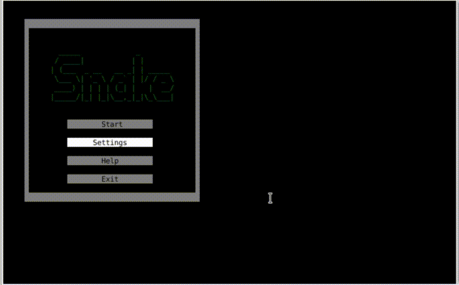
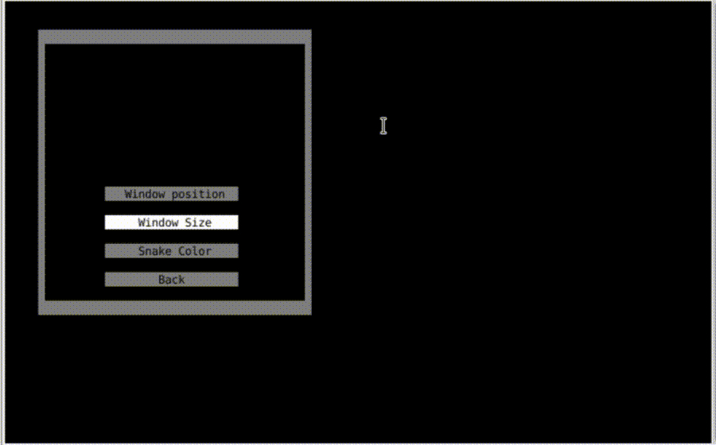

# ConsoleSnake
This is my version of snake in linux console. 
Game was created with the use of ncurses library.
#### Short Gameplay

### How to run this game?
Just install ncurses package, run the makefile and then run ConsolSnake

### About the game
This is a typical snake game where you control your snake by using 'arrows'. 
The main goal is to earn points and get bigger.  
#You can also change the game window position 

 #size 

 #and snake color 

