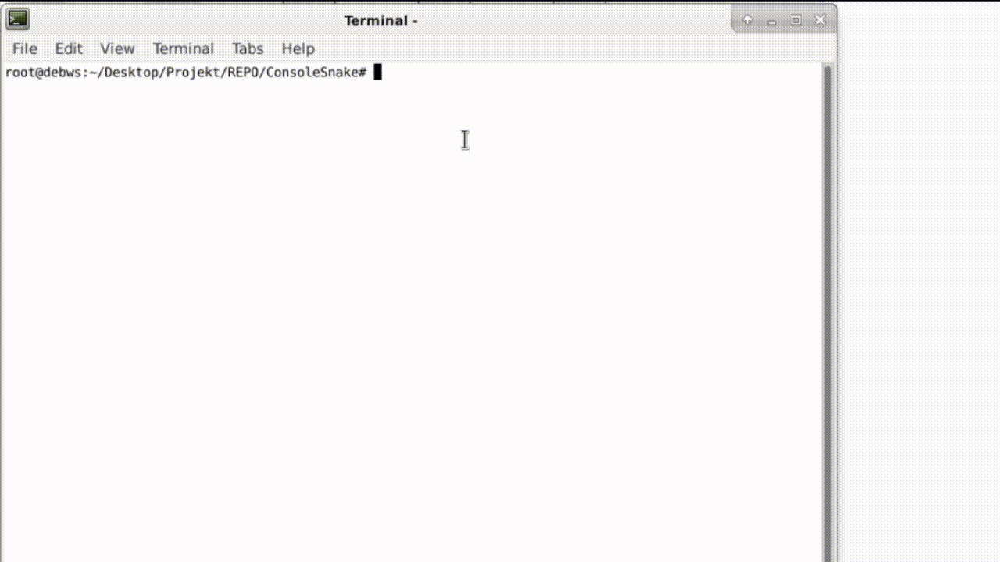

# ConsoleSnake
This is my version of snake in linux console. 
Game was created with the use of ncurses library.
### About the game
This is a typical snake game where you control your snake by using 'arrows'. 
The main goal is to earn points and get bigger. 
To navigate through the menu, use the 'arrows' and 'enter' 
#### Short Gameplay

### How to run this game?
Just install ncurses package, run the makefile and then run ConsolSnake

 

### Settings  
You can also change the game window position, size and snake color 

